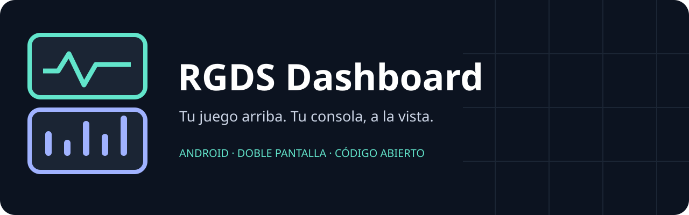

# RGDS Dashboard · v0.4 pública de prueba

Un panel para la segunda pantalla de tu consola: consulta batería, memoria y sensores
mientras juegas, elige un fondo y guarda un reporte cuando algo falla. Puedes elegir
el juego o emulador y la pantalla que utilizas; no está limitado a Minecraft.

**[Descargar APK de las Releases públicas](https://github.com/Riv0Trill224/RGDS-Dashboard/releases)**
→ abre la versión de prueba y descarga **RGDS-Dashboard.apk**. No necesitas compilar
ni descargar el código para instalarla. Es software experimental: una compilación
en verde no certifica que todas las métricas funcionen en tu consola.

## Qué hace v0.4

- Solicita/verifica root al abrir y lo usa para CPU y sensores; batería/RAM siguen
  usando Android. Muestra permisos, fuentes, errores y hora de la última lectura.
- Permite elegir cualquier paquete y pantalla disponible, abrir el juego en ella y
  solicitar mover el panel. La ROM decide si admite esos movimientos.
- FPS experimental de la **superficie elegida** mediante tiempos de SurfaceFlinger;
  no son los Hz de pantalla ni se garantiza equivalencia con los FPS internos del juego.
- Pruebas separadas, registros persistentes, resultado y reporte de incidencias con
  pasos/esperado/observado. Exportación y correo con adjunto, revisado por el usuario.
- Consulta actualizaciones al abrir (máximo una comprobación cada seis horas) y desde
  Opciones. Descarga tras aceptar, verifica hash/paquete/versión/firma y abre el instalador.
- Fondo personalizable, oscurecimiento, INFO técnico, logo original y enlace a GitHub.

## Primer uso

1. Instala la APK y abre Dashboard. Autoriza root en tu gestor si lo tienes.
2. En **Opciones**, elige juego/emulador y la pantalla que físicamente corresponda.
   Los IDs se muestran para que puedas distinguirlas; no se asume que arriba sea 0 o 1.
3. Abre el juego. Para FPS, selecciona su superficie y confirma que corresponde a
   la ventana elegida. Si la ROM no entrega tiempos válidos verás `--` y una causa.
4. **Pruebas → Iniciar nueva prueba**. Al terminar elige resultado y revisa el reporte.
5. **Pruebas → Configurar correo de destino** guarda la dirección del buzón dedicado.
   No pide contraseña. Sin correo en la consola, usa **LOG** y envía el archivo desde PC.

## Actualizaciones y firma

Desde v0.4 la app consulta el canal público, incluidas pre-releases. La instalación
necesita tu confirmación en Android; no usa root para instalar silenciosamente.
v0.2/v0.3 no incluían este actualizador: instala v0.4 manualmente esta primera vez.
Una APK debug puede requerir desinstalación por firma distinta, lo que borra datos;
respalda tus registros antes. Las APK oficiales conservan la misma clave de firma.

## Correo y privacidad

Hotfix v0.4.0-test2: destino manual por defecto `riv0trill224@icloud.com`, aviso root
y diagnóstico FPS ampliado. Autoenvío de desarrollo configurable cada cinco minutos:
requiere desplegar [el relay HTTPS/SMTP](report-relay/README.md). El código está incluido,
pero **no existe un servicio activo configurado**. Sin URL/token no envía; conserva cola.

El destinatario manual es configurable.
La app guarda hasta 10 registros privados de 2 MiB por sesión. Incluyen versión,
modelo/ROM, tiempos, selección manual, métricas y errores. No captura logcat completo
ni añade el diagnóstico RAW de otras apps al adjunto mínimo.
**Abrir el correo no confirma entrega.** El envío se confirma en el cliente y la
recepción debe comprobarse en el buzón. No se incluyen credenciales SMTP en el APK.
Ver [plan de correo](docs/EMAIL.md).

## Compatibilidad real

Android 8.0+ (API 26), interfaz adaptable a la ventana, sin servicios de Google.
No existe una lista cerrada de consolas; los permisos, sensores, pantallas y
SurfaceFlinger dependen de cada ROM. [Matriz y pruebas pendientes](docs/COMPATIBILITY.md).
En RG DS se reportó ausencia de información en v0.2: la repetición física de diez
minutos para v0.4 todavía es necesaria. No se declara compatibilidad universal.

También hay un [prototipo Linux](linux/README.md), por consola o ventana Tk, con
lecturas y logs. ROCKNIX requiere validar componentes y salidas en un equipo concreto.

## Compilar, aportar y hacer forks

Código propio y recursos originales: **GPL-3.0-or-later**, ver [LICENSE](LICENSE).
La comunidad puede estudiar, modificar, distribuir y mantener forks. Instrucciones
y expectativas en [CONTRIBUTING.md](CONTRIBUTING.md).

JDK 17, Android SDK 35/Build Tools 34.0.0, Gradle 8.9. En **CMD** desde el repositorio:

```bat
gradlew.bat :app:assembleDebug :app:testDebugUnitTest :app:lintDebug
```

El wrapper descarga Gradle cuando sea necesario. SDK en ANDROID_HOME o local.properties.
Los PR ejecutan compilación/pruebas/lint sin secretos. El flujo de publicación exige
los mismos controles y firma estable antes de crear una Release pública de prueba.
Los forks pueden usar `-PupdateRepository=OWNER/REPO`, cambiar applicationId si desean
coexistir con la app oficial y firmar con su propia clave; la huella esperada del script
de CI debe adaptarse a esa distribución. No necesitan secretos oficiales para debug.

El APK y su código fuente corresponden al mismo tag de Release. No subas claves,
contraseñas ni logs sin revisar. [Firma](docs/SIGNING.md) · [Cambios v0.4](docs/RELEASE_NOTES.md).
